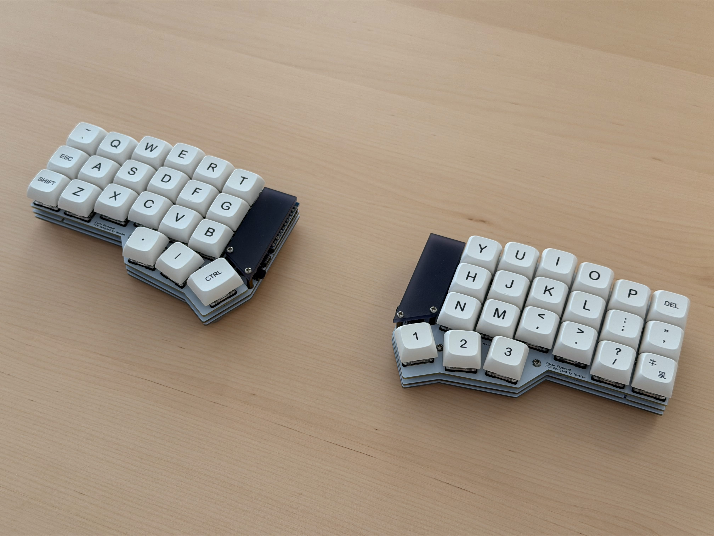

## Corne (crkbd rev1) — ergenekonyigit keymap



### Overview

-   Base layout: QWERTY with home-row Control on the left A position (tap Escape, hold Control).
-   Three momentary layers for navigation (1), symbols/media (2), and numbers/F-keys (3), plus an Adjust layer.
-   Thumb keys: Left Alt, Left GUI, Space on the base layer; right thumbs are momentary layer keys MO(\_FIRST), MO(\_SECOND), MO(\_THIRD).

Special key behaviors used in this keymap:

-   CTL_T(KC_ESC): Tap = Escape, Hold = Left Control.
-   MO(layer): Hold to access the layer; release to return.
-   QK_BOOT: Enter bootloader (for flashing firmware).

---

## Layers

### 0 — QWERTY (Base)

-   Standard QWERTY alpha keys.
-   Left home row A key is CTL_T(KC_ESC) for tap Esc / hold Ctrl.
-   Punctuation on the right; Backspace on the top-right; Enter on the bottom-right.
-   Thumbs: LAlt, LGUI, Space (left) • MO(1), MO(2), MO(3) (right).

### 1 — Navigation (MO(\_FIRST))

-   Arrow keys on both halves for convenience (Left/Down/Up/Right).
-   Quick nav/edit style with Tab, Backspace, and Enter remaining accessible.

### 2 — Symbols & Media (MO(\_SECOND))

-   Top row symbols: ~ ! @ # $ % | ^ & \* ( )
-   Brackets and punctuation: - = ` [ ] \
-   Media controls: Prev/Play-Stop/Next, Mute, Vol-, Vol+; Screen Brightness ±.
-   Right thumb includes MO(\_ADJUST) from this layer.

### 3 — Numbers & Function Keys (MO(\_THIRD))

-   Numbers 1–0 on the top rows.
-   Function keys F1–F12 on the right half.
-   Right thumb includes MO(\_ADJUST) from this layer.

### Adjust (MO(\_ADJUST))

-   QK_BOOT on the top-left to enter bootloader.
-   Other positions are unassigned placeholders (XXXXXXX) for future customization.

---

## Encoders (optional)

If ENCODER_MAP_ENABLE is enabled at build time, the map provides per-layer rotations:

-   CCW/CW: Volume Down/Up
-   CCW/CW: Media Prev/Next
-   CCW/CW: RGB Value Down/Up (e.g., RM_VALD/RM_VALU)
-   CCW/CW: Arrow Right/Left

These four encoder definitions repeat across layers 0–3.

---

## RGB Lighting

From `config.h` (active when RGBLIGHT_ENABLE is set in your keyboard/keymap build):

-   Enabled effects: Breathing, Rainbow Mood/Swirl, Snake, Knight, Christmas, Static Gradient, RGB Test, Alternating, Twinkle.
-   Value limit: 120; Steps — Hue: 10, Saturation: 17, Value: 17.

Note: The encoder mapping references RGB value up/down helpers; if RGB Matrix/Light isn’t compiled in, those actions will be no-ops.

---

## Mod-Tap behavior (tap Esc / hold Ctrl)

This keymap uses `CTL_T(KC_ESC)` on the left home-row A position: tapping sends Escape; holding acts as Left Control. To make multi-key chords like Ctrl+S then Ctrl+W reliable (without accidental Esc), the following settings are enabled in `config.h`:

-   `#define TAPPING_TERM 200` – a comfortable window to detect taps vs. holds.
-   `#define HOLD_ON_OTHER_KEY_PRESS` – if another key is pressed while holding the Mod-Tap, it’s treated as a hold (Ctrl), making chords consistent.
-   `#define TAPPING_FORCE_HOLD` – once used as a hold during a chord, releasing won’t send the tap key (prevents stray Esc on roll-off).

How to test:

-   Hold the A key (Mod-Tap).
-   Press S, then (optionally still holding) press W.
-   Result should be Ctrl+S and Ctrl+W with no Esc events.

Optional tuning:

-   If you prefer snappier taps, lower `TAPPING_TERM` (e.g., 170–180). If you need more forgiveness, raise it slightly.
-   You may also experiment with `PERMISSIVE_HOLD` (treats early releases as holds in some rolls), but it can increase unintended holds for fast typists. Use only if needed in addition to the above.

---

## Build options

From `rules.mk`:

-   MOUSEKEY_ENABLE = no
-   EXTRAKEY_ENABLE = yes (enables media keys, etc.)

---

## Build and flash

Target: crkbd/rev1 • Keymap: ergenekonyigit

### Compile

### Overview

-   Base layout: QWERTY with home-row Control on the left A position (tap Escape, hold Control).
-   Three momentary layers for symbols/media (1), numbers/F-keys (2), and navigation (3), plus an Adjust layer.
-   Thumb keys: Left Alt, Left GUI, Space on the base layer; right thumbs are momentary layer keys MO(\_FIRST), MO(\_SECOND), MO(\_THIRD).

```
### 1 — Symbols & Media (MO(_FIRST))
-   Symbols and punctuation: ~ ! @ # $ % ^ & * ( ) and more, with brackets - = ` [ ] \
-   Media controls: Prev/Play-Pause/Next, Mute, Vol-, Vol+; Screen Brightness ±.
-   Right thumb includes MO(_ADJUST) from this layer.

### 2 — Numbers & Function Keys (MO(_SECOND))
-   Numbers 1–0 on the top rows.
-   Function keys F1–F12 on the right half.
-   Right thumb includes MO(_ADJUST) from this layer.
### Enter bootloader
### 3 — Navigation (MO(_THIRD))
-   Arrow keys on both halves for convenience (Left/Down/Up/Right).
-   Quick nav/edit style with Tab, Backspace, and Enter remaining accessible.

## Quick reference
-   Base: QWERTY with tap Esc/hold Ctrl on the left home A key.
-   Layer 1: Symbols, brightness, media; MO(_ADJUST) on the right thumb.
-   Layer 2: Numbers and F-keys; MO(_ADJUST) on the right thumb.
-   Layer 3: Navigation & arrows.
-   Adjust: Bootloader access (QK_BOOT).
qmk flash -kb crkbd/rev1 -km ergenekonyigit
```

For split boards, flash each half as required by your MCU/bootloader (e.g., Pro Micro/Elite-C/Nice!Nano procedures).

---

## Quick reference

-   Base: QWERTY with tap Esc/hold Ctrl on the left home A key.
-   Layer 1: Navigation & arrows.
-   Layer 2: Symbols, brightness, media; MO(\_ADJUST) on the right thumb.
-   Layer 3: Numbers and F-keys; MO(\_ADJUST) on the right thumb.
-   Adjust: Bootloader access (QK_BOOT).

Customize freely by editing `keymap.c`, `config.h`, and `rules.mk` in this folder.
